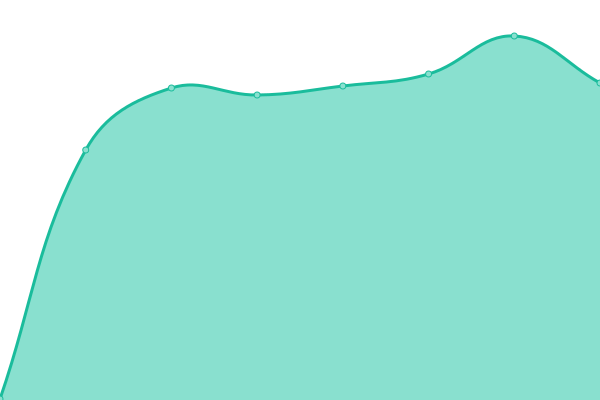

# [📈 Live Status](https://FogSwim.github.io/xfar-uptime): <!--live status--> **🟩 All systems operational**

<!--start: d-->

**Upptime** (https://upptime.js.org) is the open-source uptime monitor and status page, powered entirely by GitHub Actions, Issues, and Pages. It's made with 💚 by your friends at [Koj](https://koj.co).

> I find Upptime an incredible clever usage of \[GitHub Actions]. You essentially get a free configurable uptime monitor for whatever you want. – [CSS Tricks](https://css-tricks.com/upptime/)

Upptime is used by [**1,000+**](https://github.com/topics/upptime) people and teams to ensure they know when their endpoints go down.

<!--end: description-->

<!--start: status pages-->
<!-- This summary is generated by Upptime (https://github.com/upptime/upptime) -->
<!-- Do not edit this manually, your changes will be overwritten -->
<!-- prettier-ignore -->
| URL | Status | History | Response Time | Uptime |
| --- | ------ | ------- | ------------- | ------ |
|  [FogSwim](https://www.fogswim.com/) | 🟩 Up | [fog-swim.yml](https://github.com/fogswim/xfar-uptime/commits/HEAD/history/fog-swim.yml) | 

 333ms
     
 | 

<a href="https://FogSwim.github.io/xfar-uptime/history/fog-swim">100.00%</a>
    

<!--end: status pages-->

[**Visit our status website →**](https://FogSwim.github.io/xfar-uptime)

## 📄 License

- Powered by: [Upptime](https://github.com/upptime/upptime)
- Code: [MIT](./LICENSE) © [FogSwim Technologies](www.fogswim.com)
- Data in the `./history` directory: [Open Database License](https://opendatacommons.org/licenses/odbl/1-0/)
